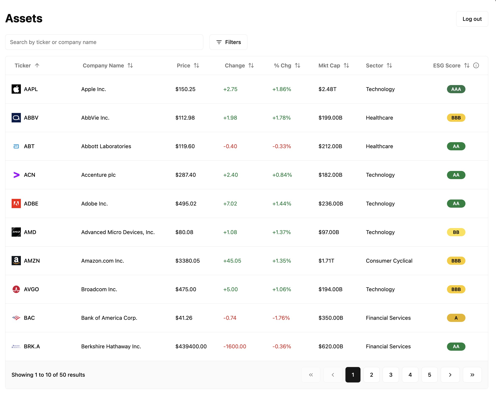

# Asset Search Demo

A simple frontend for a simple asset table with search, sort, multi-filter.
Fleshing out a skeleton for how I would build something similar.

Demo credentials are

- Email: `demo@example.com`
- Password: `demo`

Note that data (in `src/assets/stock-data.mock.ts`) is ChatGPT-generated. ESG scores are inspired by MSCI ESG ratings but they are in no way reflective of reality.

## Known Issues

1. Due to the nature of GitHub Pages, while rewriting to history/location seems to work fine (and would work fine if deployed elsewhere), when attempting to navigate directly to the route that's written (e.g., `.../asset-list-demo/assets`) it will fail as it queries GitHub's resource for that route (i.e., trying to fetch the deployment at that route), rather than defaulting to the "base" deployment of said route (in this case, the current deployment). This is also the case for refreshes.
   - In this case, I think it's better just to drop the routing aspect entirely and stick to the SPA.
2. Data tables are always wonky in mobile, but there appears to be an issue where the window is slightly offset when entering the assets page. Not sure why this is.
  - One resolution may be to force a scroll up on load. Another may be to reduce the size of the pages on mobile. 

## Development

This is a Vite + React + TypeScript + Tailwind project bootstrapped from [`create-vite`](https://www.npmjs.com/package/create-vite).
